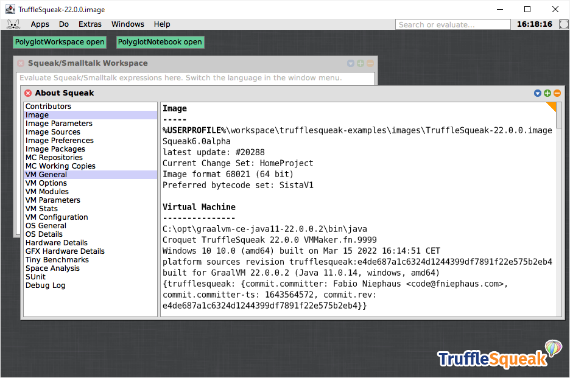

# TruffleSqueak on Microsoft Windows

<table style="font-family:Helvetica,Arial;font-size:14px;line-height:1.6;">
  <tr>
  <td style="border:0;padding:0 10px 0 0;min-width:120px;"></td>
  <td style="border:0;padding:0;vertical-align:text-top;">This repository gathers <a href="https://squeak.org/" rel="external">Squeak</a> code examples coming from various websites and books. 
  It also includes several <a href="https://en.wikibooks.org/wiki/Windows_Batch_Scripting" rel="external">batch files</a> for experimenting with <a href="https://github.com/hpi-swa/trufflesqueak" rel="external">TruffleSqueak</a> on a Windows machine.
  </td>
  </tr>
</table>

This document is part of a series of topics related to [TruffleSqueak] on Windows:

- Installing [TruffleSqueak] on Windows [**&#9660;**](#bottom)
- [Building TruffleSqueak on Windows](BUILD.md)
<!--
- [Using **`gu.bat`** on Windows](GU.md) <a href="#footnote_0X">[X]</a>
-->

[Ada][ada_examples], [Akka][akka_examples], [C++][cpp_examples], [Deno][deno_examples], [Golang][golang_examples], [GraalVM][graalvm_examples], [Haskell][haskell_examples], [Kotlin][kotlin_examples], [LLVM][llvm_examples], [Node.js][nodejs_examples], [Rust][rust_examples], [Scala 3][scala3_examples], [Spark][spark_examples], [Spring][spring_examples] and [WiX][wix_examples] are other trending topics we are currently monitoring.

## Project dependencies

This project depends on the following external software for the **Microsoft Windows** platform:

- [Git 2.38][git_downloads] ([*release notes*][git_relnotes])
- [TruffleSqueak Image 22.2][trufflesqueak_image]
- [GraalVM Community Edition 22.2 LTS][graalvm_downloads] ([*release notes*][graalvm_relnotes])

Optionally one may also install the following software:
- [Squeak 6.0][squeak_downloads] <a href="#footnote_01">1</a>

For instance our development environment looks as follows (*October 2022*) [2](#footnote_02):

<pre style="font-size:80%;">
C:\opt\graalvm-ce-java11-22.2.0\<a href="#footnote_03">3</a>   <i>(695 MB)</i>
C:\opt\Git-2.38.0\                  <i>(317 MB)</i>
C:\opt\Squeak-6.0\                  <i>(130 MB)</i>
</pre>

> **&#9755;** ***Installation policy*** 
> When possible we install software from a [Zip archive][zip_archive] rather than via a Windows installer. In our case we defined **`C:\opt\`** as the installation directory for optional software tools (*in reference to* the [**`/opt/`**][linux_opt] directory on Unix).

## Directory structure
<!--
<a href="bin/gu.bat">bin\gu.bat</a> <i>(deprecated)</i><a href="#footnote_0X">[X]</a>
<a href="GU.md">GU.md</a>      <i>(deprecated)</i>
-->
This project is organized as follows:
<pre style="font-size:80%;">
docs\
<a href="examples/README.md">examples\README.md</a>
<a href="BUILD.md">BUILD.md</a>
README.md
<a href="setenv.bat">setenv.bat</a>
</pre>

where

<!--
- file [**`bin\gu.bat`**](bin/gu.bat) is the batch script for *installing* the [TruffleSqueak] component on a Windows machine.
- file [**`GU.md`**](GU.md) is the [Markdown][github_markdown] document presenting the usage of the [GraalVM Updater][gu_refman] tool.
-->
- directory [**`docs\`**](docs/) contains [TruffleSqueak] related papers/articles.
- directory [**`examples\`**](examples/) contains [Squeak] code examples (see [**`examples\README.md`**](examples/README.md)).
- file [**`BUILD.md`**](BUILD.md) is the Markdown document presenting the generation of the [TruffleSqueak] component.
- file [**`README.md`**](README.md) is the Markdown document for this page.
- file [**`setenv.bat`**](setenv.bat) is the batch script for setting up our environment.

We also define a virtual drive **`T:`** in our working environment in order to reduce/hide the real path of our project directory (see article ["Windows command prompt limitation"][windows_limitation] from Microsoft Support).

> **:mag_right:** We use the Windows external command [**`subst`**][windows_subst] to create virtual drives; for instance:
>
> <pre style="font-size:80%;">
> <b>&gt; <a href="https://docs.microsoft.com/en-us/windows-server/administration/windows-commands/subst">subst</a> T: <a href="https://en.wikipedia.org/wiki/Environment_variable#Default_values">%USERPROFILE%</a>\workspace\trufflesqueak-examples</b>
> </pre>

In the next section we give a brief description of the batch files present in this project.

## Batch commands

We distinguish different sets of batch commands:

1. [**`setenv.bat`**](setenv.bat) - This batch command makes external tools such as [**`java.exe`**][java_exe] and [**`git.exe`**][git_cli] directly available from the command prompt (see section [**Project dependencies**](#proj_deps)).

    <pre style="font-size:80%;">
    <b>&gt; <a href="setenv.bat">setenv</a> help</b>
    Usage: setenv { &lt;option&gt; | &lt;subcommand&gt; }
    &nbsp;
      Options:
        -debug      show commands executed by this script
        -travis     start Git bash shell instead of Windows command prompt
        -verbose    display progress messages
    &nbsp;
      Subcommands:
        help        display this help message
    </pre>
<!--
2. [**`bin\gu.bat`**](bin/gu.bat) ***(deprecated)*** - This batch command features commands to manage the [GraalVM] environment. This *temporary* solution is a stripped down implementation of Oracle's [**`gu`**][gu_refman] command. 
-->
In the next section we present usage examples of the batch files present in this project.

## Usage examples

#### `setenv.bat`

Command [**`setenv`**](setenv.bat) is executed once to setup our development environment; it makes external tools such as [**`jar.exe`**][jar_exe] and [**`git.exe`**][git_cli] directly available from the command prompt:

<pre style="font-size:80%;">
<b>&gt; <a href="setenv.bat">setenv</a></b>
Tool versions:
   python 3.10.5, pylint 2.12.2, javac 11.0.16
   git 2.38.0.windows.1, bash 4.4.23(1)-release

<b>&gt; <a href="https://docs.microsoft.com/en-us/windows-server/administration/windows-commands/where">where</a> git link</b>
C:\opt\Git-2.38.0\bin\git.exe
C:\opt\Git-2.38.0\mingw64\bin\git.exe
C:\opt\Git-2.38.0\usr\bin\link.exe
</pre>

Command **`setenv -verbose`** also displays the tool paths:

<pre style="font-size:80%;">
<b>&gt; <a href="setenv.bat">setenv</a> -verbose</b>
Tool versions:
   python 3.10.5, pylint 2.12.2, javac 11.0.16
   git 2.38.0.windows.1, bash 4.4.23(1)-release
Tool paths:
   C:\opt\Python-3.10.5\python.exe
   C:\opt\Python-3.10.5\Scripts\pylint.exe
   C:\opt\Git-2.38.0\bin\git.exe
   C:\opt\Git-2.38.0\mingw64\bin\git.exe
   C:\opt\Git-2.38.0\bin\bash.exe
Environment variables:
   "GIT_HOME=C:\opt\Git-2.38.0"
   "GRAAL_HOME=C:\opt\graalvm-ce-java11-22.2.0"
   "JAVA_HOME=C:\opt\graalvm-ce-java11-22.2.0"
   "MSVC_HOME=C:\Program Files (x86)\Microsoft Visual Studio\2019\Community\VC"
   "MSVS_HOME=C:\Program Files (x86)\Microsoft Visual Studio\2019"
   "PYTHON_HOME=C:\opt\Python-3.10.5"
</pre>

#### `gu.bat install` ***(deprecated)***

> **&#9755;** Starting with *version 20.0* command `gu.cmd` is part of the [GraalVM] distribution; Windows users should use `gu.cmd` instead of `gu.bat`.

Command [**`gu.bat install -h`**](bin/gu.bat) displays the help message for command **`install`**.

<pre style="font-size:80%;">
<b>&gt; <a href="bin/gu.bat">gu</a> install -h</b>
Usage: gu install [-0cdfhiLnoruv] {&lt;param&gt;}
Install specified components from file, URL or catalog.
&nbsp;
  Options:
    -0, --dry-run        Dry run. Do not change any files.
    -c, --catalog        Treat parameters as component IDs from catalog. This is the default.
    -d, --debug          Show commands executed by this script.
    -f, --force          Disable installation checks.
    -h, --help           Display this help message.
    -i, --fail-existing  Fail if the to be installed component already exists.
    -L, --local-file     Treat parameters as local filenames of packaged components.
    -n, --no-progress    Do not display download progress.
    -o, --overwrite      Silently overwrite previously installed component.
    -r, --replace        Replace different files.
    -u, --url            Treat parameters as URLs
    -v, --verbose        Enable verbose output.
</pre>

Command [**`gu.bat install`**](bin/gu.bat) can add [GraalVM] installable components in three different ways, namely:
<ul>
<li>from a catalog <i>(default, option </i><b><code>-c</code></b><i>)</i></li>
<li>from a local component archive <i>(option </i><b><code>-L</code></b><i>)</i></li>
<li>from a remote component archive <i>(option </i><b><code>-u</code></b><i>)</i></li>
</ul>

We present below the installation from a *local* [TruffleSqueak] component archive; further usage examples are available in document [GU.md](GU.md).

Let's first download [TruffleSqueak] component archive from the [TruffleSqueak] repository:

<pre style="font-size:80%;">
<b>&gt; <a href="https://curl.se/docs/manpage.html">curl</a> -sL -o trufflesqueak-installable.jar https://github.com/hpi-swa/trufflesqueak/releases/download/22.2.0/trufflesqueak-installable-java8-windows-amd64-22.2.0.jar</b>
</pre>

Command [**`gu.bat install -L trufflesqueak-component.jar`**](bin/gu.bat) adds the [TruffleSqueak] component to our [GraalVM] environment.

<pre style="font-size:80%;">
<b>&gt; <a href="https://docs.microsoft.com/en-us/windows-server/administration/windows-commands/echo">echo</a> %GRAALVM_HOME%</b>
C:\opt\graalvm-ce-java11-22.2.0
&nbsp;
<b>&gt; <a href="bin/gu.bat">gu</a> install -L trufflesqueak-installable.jar</b>
Processing Component archive: trufflesqueak-installable-java11-windows-amd64-22.2.0.jar
Installing new component: TruffleSqueak (org.graalvm.smalltalk, version 22.2.0)
</pre>

The [GraalVM] installation directory looks as follows after adding the [TruffleSqueak] component:

<pre style="font-size:80%;">
<b>&gt; <a href="https://docs.microsoft.com/en-us/windows-server/administration/windows-commands/where">where</a> /r c:\opt\graalvm-ce-java11-22.1.0 *squeak*</b>
c:\opt\graalvm-ce-java11-22.1.0\bin\trufflesqueak.cmd
c:\opt\graalvm-ce-java11-22.1.0\languages\smalltalk\LICENSE_TRUFFLESQUEAK.txt
c:\opt\graalvm-ce-java11-22.1.0\languages\smalltalk\README_TRUFFLESQUEAK.md
c:\opt\graalvm-ce-java11-22.1.0\languages\smalltalk\trufflesqueak-shared.jar
c:\opt\graalvm-ce-java11-22.1.0\languages\smalltalk\trufflesqueak-shared.src.zip
c:\opt\graalvm-ce-java11-22.1.0\languages\smalltalk\trufflesqueak.jar
c:\opt\graalvm-ce-java11-22.1.0\languages\smalltalk\trufflesqueak.src.zip
c:\opt\graalvm-ce-java11-22.1.0\languages\smalltalk\bin\trufflesqueak.cmd
c:\opt\graalvm-ce-java11-22.1.0\languages\smalltalk\lib\SqueakFFIPrims.dll
c:\opt\graalvm-ce-java11-22.1.0\lib\graalvm\trufflesqueak-launcher.jar
c:\opt\graalvm-ce-java11-22.1.0\lib\graalvm\trufflesqueak-launcher.src.zip
</pre>

> **:mag_right:** In the above output both command files **`bin\trufflesqueak.cmd`** and **`jre\bin\trufflesqueak.cmd`** simply forward the call to command file **`jre\languages\smalltalk\bin\trufflesqueak.cmd`** (on Unix systems two symbolic links are created instead).
> <pre style="font-size:80%;">
> <b>&gt; <a href="https://docs.microsoft.com/en-us/windows-server/administration/windows-commands/type">type</a> c:\opt\graalvm-ce-java11-22.1.0\bin\trufflesqueak.cmd</b>
> @echo off
> &nbsp;
> call :getScriptLocation location
> "%location%..\jre\bin\trufflesqueak.cmd" %*
> goto :eof
> &nbsp;
> :: If this script is in `%PATH%` and called quoted without a full path (e.g., `"js"`), `%~dp0` is expanded to `cwd`
> :: rather than the path to the script.
> :: This does not happen if `%~dp0` is accessed in a subroutine.
> :getScriptLocation variableName
>     set "%~1=%~dp0"
>     exit /b 0
> &nbsp;
> <b>&gt; <a href="https://docs.microsoft.com/en-us/windows-server/administration/windows-commands/type">type</a> c:\opt\graalvm-ce-java11-22.1.0\jre\bin\trufflesqueak.cmd</b>
> @echo off
> &nbsp;
> call :getScriptLocation location
> "%location%..\languages\smalltalk\bin\trufflesqueak.cmd" %*
> goto :eof
> ...
> </pre>
> Command file **`jre\languages\smalltalk\bin\trufflesqueak.cmd`** itself is copied from template file [**`template.trufflesqueak.cmd`**][trufflesqueak_cmd] during the generation of the [TruffleSqueak] component.

## Squeak execution

Command **`trufflesqueak.cmd --help`** prints the usage message:

<pre style="font-size:80%;">
<b>&gt; <a href="https://docs.microsoft.com/en-us/windows-server/administration/windows-commands/where">where</a> trufflesqueak</b>
C:\opt\graalvm-ce-java11-22.2.0\bin\trufflesqueak.cmd
&nbsp;
<b>&gt; trufflesqueak.cmd --help</b>
Usage: trufflesqueak [options] &lt;image file> [image arguments]

Basic options:
  -c "&lt;code&gt;", --code "&lt;code&gt;"          Smalltalk code to be executed in headless mode
  --headless                            Run in headless mode
  --enable-transcript-forwarding        Forward stdio to Smalltalk transcript

Runtime options:
  --polyglot                            Run with all other guest languages accessible.
  --jvm                                 Run on the Java Virtual Machine with Java access (default).
  --vm.[option]                         Pass options to the host VM. To see available options, use '--help:vm'.
  --help                                Print this help message.
  --help:languages                      Print options for all installed languages.
  --help:tools                          Print options for all installed tools.
  --help:vm                             Print options for the host VM.
  --help:expert                         Print additional options for experts.
  --help:internal                       Print internal options for debugging language implementations and tools.
  --version:graalvm                     Print GraalVM version information and exit.
  --show-version:graalvm                Print GraalVM version information and continue execution.
  --log.file=&lt;String&gt;                   Redirect guest languages logging into a given file.
  --log.[logger].level=&lt;String&gt;         Set language log level to OFF, SEVERE, WARNING, INFO, CONFIG, FINE, FINER, FINEST or ALL.

See https://www.graalvm.org for more information.
</pre>

Command **`trufflesqueak --version:graalvm`** prints the version of the installed languages and tools: 

<pre style="font-size:80%;">
<b>&gt; %GRAALVM_HOME%\bin\trufflesqueak.cmd --version:graalvm</b>
GraalVM CE JVM Polyglot Engine Version 22.2.0
Java Version 11.0.16
Java VM Version GraalVM 22.2.0 Java 11 CE
GraalVM Home C:\opt\graalvm-ce-java11-22.2.0
  Installed Languages:
    Java             version 22.2.0
    JavaScript       version 22.2.0
    Squeak/Smalltalk version 22.2.0
    WebAssembly      version 22.2.0
  Installed Tools:
    Agent Script            version 1.1
    Code Coverage           version 0.1.0
    CPU Sampler             version 0.5.0
    CPU Tracer              version 0.3.0
    Debug Protocol Server   version 0.1
    heap                    version 22.1.0
    Heap Allocation Monitor version 0.1.0
    Insight                 version 1.1
    Chrome Inspector        version 0.1
    Language Server         version 0.1
    Memory Tracer           version 0.2
</pre>

Command **`trufflesqueak`** (with no argument) opens a dialog window for selecting a Squeak image before starting the Squeak IDE.

> **:mag_right:** We have the choice between two Squeak images:
> - [TruffleSqueak project][trufflesqueak] : [**`TruffleSqueakImage-<version>.image`**][trufflesqueak_image].
> - [Squeak project][squeak] : [**`Squeak<version>-64bit.image`**][squeak_downloads]. 
> &nbsp;

Command **`trufflesqueak TruffleSqueak-22.2.0.image`** <a href="#footnote_04">4</a> starts the Squeak IDE and loads the provided Squeak image.

<a href="docs/images/TruffleSqueak-22.0.0.image.png">

(Click to enlarge)
</a>

Code examples are presented in document [`examples\README.md`](examples/README.md).

## Footnotes
<!--
[X] **`gu.bat`** ***deprecation*** [↩](#anchor_0X)

Starting with version 20.0 command <a href="https://www.graalvm.org/docs/reference-manual/install-components/"><b><code>gu.cmd</code></b></a> is part of the <a href="https://www.graalvm.org/">GraalVM</a> distribution; Windows users should use <b><code>gu.cmd</code></b> instead of <b><code>gu.bat</code></b>.

<dl><dd>
We wrote <a href="bin/gu.bat"><code><b>gu.bat</code></b></a> to add the <a href="https://github.com/hpi-swa/trufflesqueak">TruffleSqueak</a> component (or any installable component such as <a href="https://github.com/oracle/fastr">FastR</a>, <a href="https://github.com/graalvm/graalpython">GraalPython</a> or <a href="https://github.com/oracle/truffleruby">TruffleRuby</a> to our <a href="https://www.graalvm.org/">GraalVM</a> environment. More details on the usage of this command are available in document <a href="GU.md"><code>GU.md</code></a>.
</dd></dl>
-->
[1] ***Squeak image*** [↩](#anchor_01)

<dl><dd>
A Squeak image is required to run/test the <a href="https://github.com/hpi-swa/trufflesqueak" rel="external">TruffleSqueak</a> installable component. Concretely we can either install the full <a href="https://squeak.org/downloads/">Squeak distribution</a> (32 MB) or we can just download the <a href="https://squeak.org/downloads/">Squeak image</a> (18 MB).
</dd></dl>

[2] ***Downloads*** [↩](#anchor_02)

<dl><dd>
In our case we downloaded the following installation files (see <a href="#proj_deps">section 1</a>):
</dd></dl>
<pre style="margin:0 0 1em 20px; font-size:80%;">
<a href="https://github.com/hpi-swa/trufflesqueak/releases/tag/22.2.0">trufflesqueak-installable-svm-java11-windows-amd64-22.2.0.jar</a>  <i>(135 MB)</i>
<a href="https://github.com/graalvm/graalvm-ce-builds/releases">graalvm-ce-java11-windows-amd64-22.2.0.zip</a>      <i>(154 MB)</i>
<a href="https://git-scm.com/download/win">PortableGit-2.38.0-64-bit.7z.exe</a>                <i>( 41 MB)</i>
<a href="http://files.squeak.org/5.3/">Squeak5.3-19448-64bit-202003021730-Windows.zip</a>  <i>( 33 MB)</i>
</pre>

[3] ***GraalVM and Java 8*** [↩](#anchor_03)

<dl><dd>
Starting with version 21.3 GraalVM distributions are targeting Java 11 and Java 17; Java 8 users need to stay with <a href="https://github.com/graalvm/graalvm-ce-builds/releases/tag/vm-21.2.0" rel="external">GraalVM version 21.2</a>.
</dd></dl>

[4] **`TruffleSqueak-22.2.0.image`** [↩](#anchor_04)

<dl><dd>
<pre style="font-size:80%;">
<b>&gt; <a href="https://curl.se/docs/manpage.html">curl</a> -sL -o TruffleSqueakImage-22.2.0.zip https://github.com/hpi-swa/trufflesqueak/releases/download/22.2.0/TruffleSqueakImage-22.2.0.zip</b>
&nbsp;
<b>&gt; <a href="https://linux.die.net/man/1/unzip">unzip</a> -qo TruffleSqueakImage-22.2.0.zip</b>
 &nbsp;
<b>&gt; trufflesqueak.cmd TruffleSqueak-22.2.0.image</b>
</pre>
</dd>
<dd>
The contents of downloaded archive file <b><code>TruffleSqueakImage.zip</code></b> looks as follows:
</dd>
<dd>
<pre style="font-size:80%;">
<b>&gt; <a href="https://linux.die.net/man/1/unzip">unzip</a> -l TruffleSqueakImage-22.2.0.zip</b>
Archive:  archives_LOCAL\TruffleSqueakImage-22.2.0.zip
  Length      Date    Time    Name
---------  ---------- -----   ----
 67907640  2022-01-30 18:39   TruffleSqueak-22.2.0.image
 24247334  2022-01-30 18:39   TruffleSqueak-22.2.0.changes
 35184983  2017-02-06 09:21   SqueakV50.sources
---------                     -------
127339957                     3 files
</pre>
</dd></dl>

<!--
[4] ***GraalVM Updater*** [↩](#anchor_04)

Command <a href="https://www.graalvm.org/docs/reference-manual/install-components/"><b><code>gu</code></b></a> is not yet supported on Microsoft Windows, so we currently run our own (stripped down) command <a href="bin/gu.bat"><b><code>bin\gu.bat</code></b></a> to add the <a href="https://github.com/hpi-swa/trufflesqueak">TruffleSqueak</a> component (e.g. archive file <b><code>trufflesqueak-component.jar</code></b>) to our <a href="https://www.graalvm.org/">GraalVM</a> environment (e.g. <b><code>c:\opt\graalvm-ce-java8-20.1.0\</code></b>).

-->

***

*[mics](https://lampwww.epfl.ch/~michelou/)/October 2022* [**&#9650;**](#top)
&nbsp;

<!-- hrefs -->

[ada_examples]: https://github.com/michelou/ada-examples
[akka_examples]: https://github.com/michelou/akka-examples
[cpp_examples]: https://github.com/michelou/cpp-examples
[deno_examples]: https://github.com/michelou/deno-examples
[fastr]: https://github.com/oracle/fastr
[git_cli]: https://git-scm.com/docs/git
[git_downloads]: https://git-scm.com/download/win
[git_relnotes]: https://raw.githubusercontent.com/git/git/master/Documentation/RelNotes/2.38.0.txt
[github_markdown]: https://github.github.com/gfm/
[graalpython]: https://github.com/graalvm/graalpython
[graalvm]: https://www.graalvm.org/
[graalvm_downloads]: https://github.com/graalvm/graalvm-ce-builds/releases
[golang_examples]: https://github.com/michelou/golang-examples
[graalvm_examples]: https://github.com/michelou/graalvm-examples
[graalvm_relnotes]: https://www.graalvm.org/release-notes/22_0/
[gu_refman]: https://www.graalvm.org/reference-manual/graalvm-updater/
[haskell_examples]: https://github.com/michelou/haskell-examples
[jar_exe]: https://docs.oracle.com/javase/7/docs/technotes/tools/windows/jar.html
[java_exe]: https://docs.oracle.com/javase/7/docs/technotes/tools/windows/java.html
[kotlin_examples]: https://github.com/michelou/kotlin-examples
[linux_opt]: https://tldp.org/LDP/Linux-Filesystem-Hierarchy/html/opt.html
[llvm_examples]: https://github.com/michelou/llvm-examples
[nodejs_examples]: https://github.com/michelou/nodejs-examples
[rust_examples]: https://github.com/michelou/rust-examples
[scala3_examples]: https://github.com/michelou/dotty-examples
[spark_examples]: https://github.com/michelou/spark-examples
[spring_examples]: https://github.com/michelou/spring-examples
[squeak]: https://squeak.org/
[squeak_downloads]: https://squeak.org/downloads/
[truffleruby]: https://github.com/oracle/truffleruby
[trufflesqueak]: https://github.com/hpi-swa/trufflesqueak
[trufflesqueak_cmd]: https://github.com/hpi-swa/trufflesqueak/blob/dev/scripts/template.trufflesqueak.cmd
[trufflesqueak_image]: https://github.com/hpi-swa/trufflesqueak/releases/tag/22.1.0
[windows_limitation]: https://support.microsoft.com/en-gb/help/830473/command-prompt-cmd-exe-command-line-string-limitation
[windows_subst]: https://docs.microsoft.com/en-us/windows-server/administration/windows-commands/subst
[wix_examples]: https://github.com/michelou/wix-examples
[zip_archive]: https://www.howtogeek.com/178146/htg-explains-everything-you-need-to-know-about-zipped-files/
